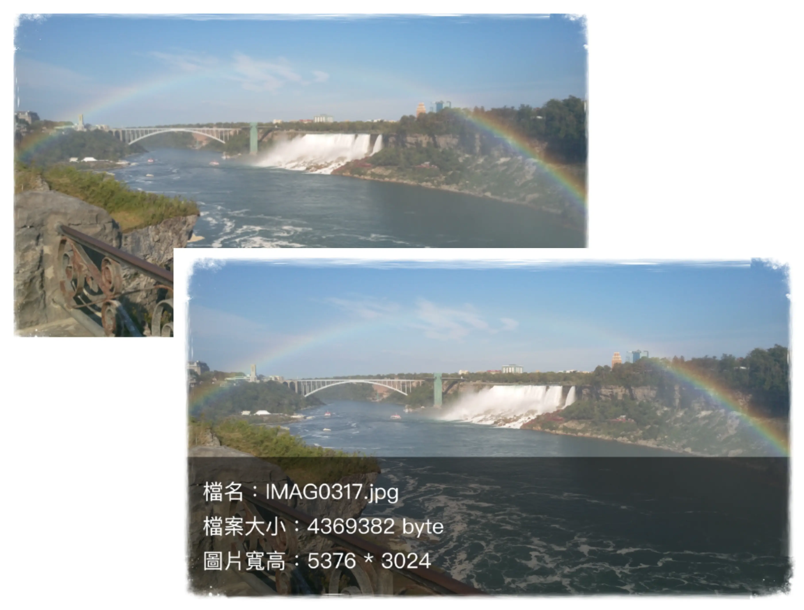
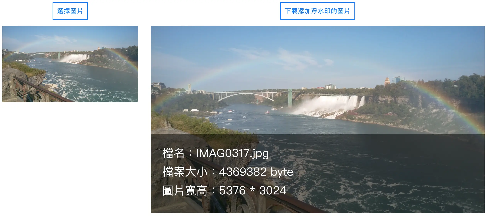

  <h1>圖片添加浮水印</h1>
  

    圖片添加浮水印：選擇圖片，會加上檔名、檔案大小、圖片寬高資訊，並可下載添加浮水印後的圖檔
  

  

    <a href="https://yuna9068.github.io/image-watermark/">Github Live Site URL</a>
  

## Table of contents

* [Features](#features)
* [Screenshot](#screenshot)
* [Built with](#built-with)
* [Author](#author)

## Features

* 圖片添加浮水印資訊：檔名、檔案大小、圖片寬高

<a href="#readme-top">⬆︎ BACK TO TOP</a>

## Screenshot

<a href="#readme-top">⬆︎ BACK TO TOP</a>

## Built with

* [Canvas](https://developer.mozilla.org/en-US/docs/Web/API/Canvas_API "Canvas API - Web APIs | MDN")：HTML5 元素

<a href="#readme-top">⬆︎ BACK TO TOP</a>

## Author

- GitHub - [Yuna](https://github.com/yuna9068)

<a href="#readme-top">⬆︎ BACK TO TOP</a>

